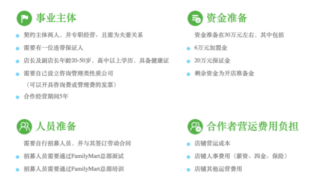
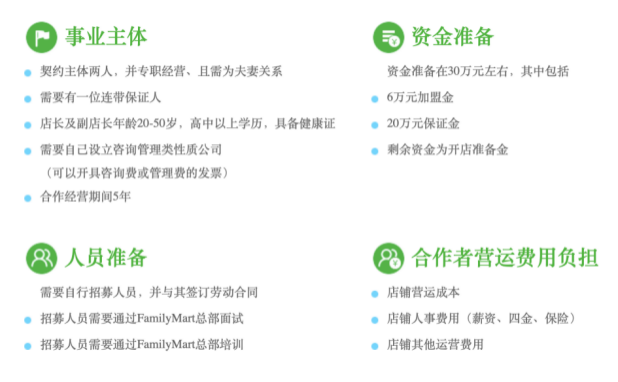

# Sideline-Possibility
A market research for sideline.

## 全集加盟创业Beta
### 1. 合作经营方案
**2FC-A**

**2FC-C**

### 2. 问题点
#### 2.1. 选址：大致方向—> 胥口镇
**选址原因：**

① 周边无全家以及任何便利店，只有一些杂牌零食店

② 周边有KFC 和大量小区以及地铁的开通能保证基本的人流量

③ 以及附近正在造学校，未来小孩子的主力军，收益客观

// TODO 需进一步考察...

#### 2.2. 另一个问题，需要店长（暂停李琳）。

### 3.风险评估
**最差损失：**
> 假设房租水电等，以胥口镇的物价来算，并且包括全家总部的对半承担。
> 
> 12w/年 / 2 = 6w 
> 
> 也就是说一年的最差损失在10w。在能力承受范围之内。
> 
> **弊端**：需要家人前期的支持：人工需协商，在进一步计算。

